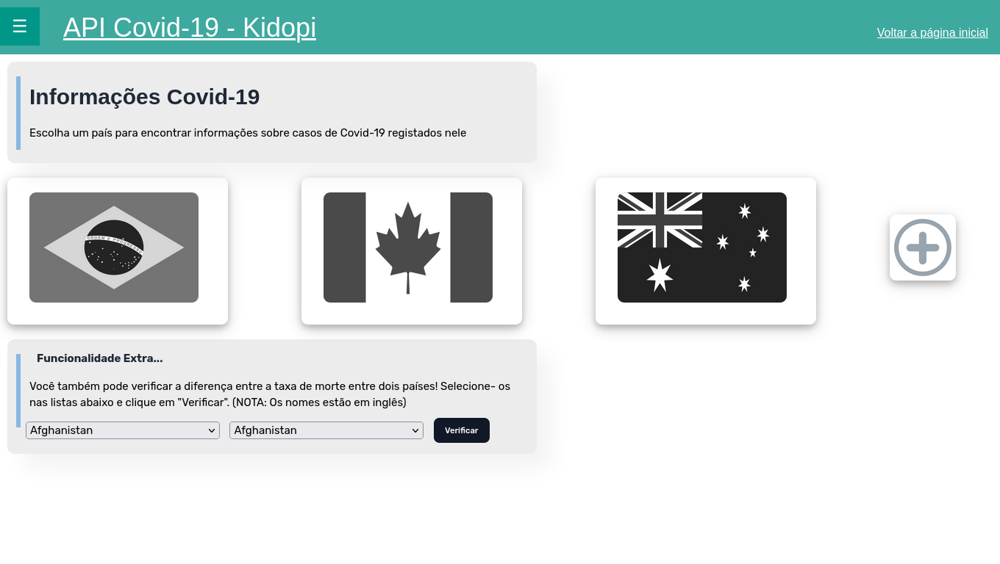

# Kidopi - API Covid-19

##### Exercício para o processo seletivo da Kidopi. O exercício consiste na construção de uma interface web que possibilite ao usuário obter informações sobre os casos de mortes por Covid. Estes dados serão obtidos por meio da API-Covid-19 que está disponível no servidor da Kidopi. É possível obter dados do número de casos confirmados e mortes de vários países afetados pela COVID-19.

## Como executar o sistema localmente

Assumindo que: 

1. O seu ambiente de desenvolvimento (PHP+MySQL) está configurado e 'rodando';
2. Que você já baixou o código-fonte deste repositório

O primeiro passo é abrir o arquivo `kidopi.sql`, executar o script e criar o banco de dados;

[NOTA]: Existem dois arquivos SQL. O `kidopi.sql` contém somente o script de criação do banco, enquanto o `kidopi_comInserts.sql` consiste num dump com a maioria dos registros dos acessos feitos à API da Kidopi. Alguns registros foram perdidos durante o processo de desenvolvimento do sistema;

[2º Nota]: Se o seu ambiente de desenvolvimento possui usuário e senha específicos, mude no arquivo "conexao.php". Ele virá com usuário 'root' e senha = "" por padrão. Se o seu ambiente estiver com outras credenciais, isso gerará um erro na conexão;

O segundo passo é abrir o seu navegador, digitar o endereço do servidor local, juntamente com o nome da pasta. Vale ressaltar que, ao fazer o download do código fonte, o nome do arquivo .zip virá com o nome do repositório. Por questões de facilidade, é recomendado que você renomeie a pasta descompactada para apenas "kidopi" e a coloque na pasta aonde os projetos web do seu servidor local devem estar (Como por exemplo na pasta 'wwww' no WAMP ou 'htdocs' no Xampp);

O endereço que você colocará no navegador web será algo do tipo "localhost/kidopi". Como a pasta já contém um arquivo chamado `index.php`, ele será carregado automaticamente. A partir daí, basta utilizar o sistema; A página inicial terá essa aparência: 

